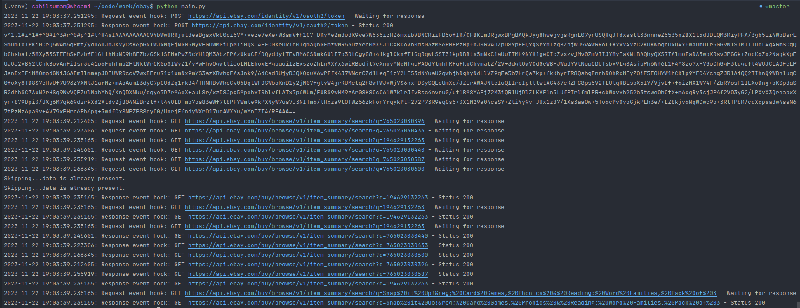

## Ebay Scraper

This script scrapes data from a CSV file and populates the product column based on the UPC code and name of the specific
product for which you want the data.

## Requirements

### Dependency Installation

Before running the script, install all required dependencies by executing the following command:

\```bash
pip install -r requirements.txt
\```

### Environment Setup

Set up the `.env` file in your project directory with the following contents:

\```python
CLIENT_ID = "your_client_id"
CLIENT_SECRET = "your_client_secret"
\```

Replace `your_client_id` and `your_client_secret` with your actual credentials.

## Dependencies

The script relies on the following Python packages:

- `pandas`: Utilized for data manipulation and analysis.
- `httpx`: Enables asynchronous HTTP requests.
- `python-dotenv`: Facilitates loading of environment variables.

## Instructions for Running the Script

### Preparing Data

1. Place all your CSV data files in the `inputs` folder within your project directory.

### Executing the Script

2. Run the script using the following command:

\```bash
python main.py
\```

This will process the data, fetching category IDs, category names, and product names.

### Output

- Upon successful execution, the script will store the processed data in the `outputs` folder, formatted as a CSV file.

### Example

For instance, if you add `data6.csv` to the `input` folder and run `python main.py`, the script will process the data
and output the results in CSV format in the `outputs` folder.

Note: The input data should contain the UPC or name, eBay cat #, eBay cat name, and product name in order for this
script to work. You can refer to the sample data in the input data to understand the format of the CSV files. This
script scrapes all the data based on the UPC code from the eBay developer endpoint and saves the data into the product
name, eBay cat #, and eBay cat name.

Also, if data is already present in the product name, it will be skipped.

### Working Screenshot 

